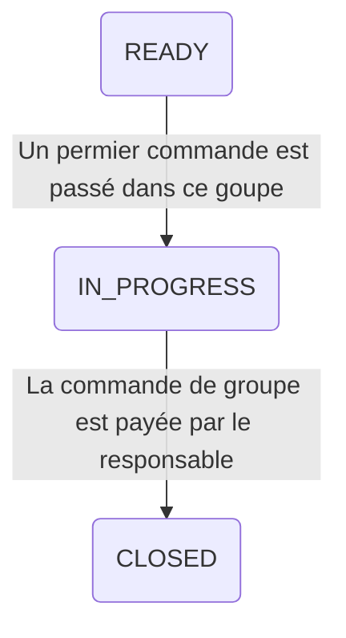
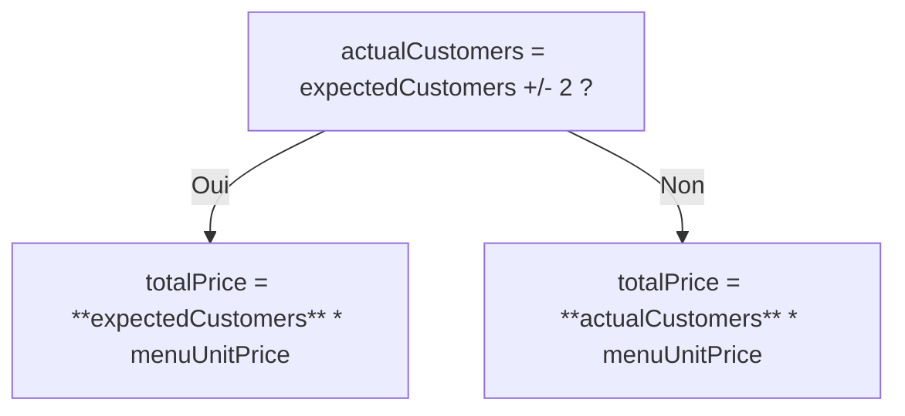

# Group Service
## Évolution de l'état d'un groupe

## Calcul du prix total à payer par le groupe
Le prix total à payer par le groupe est calculé en fonction du nombre de clients attendus et du nombre de clients réels. Si le nombre de clients réels est proche du nombre de clients attendus (écart de 2 clients ou moins), le prix total est calculé sur la base du nombre de clients attendus. Sinon, le prix total est calculé sur la base du nombre de clients réels.
